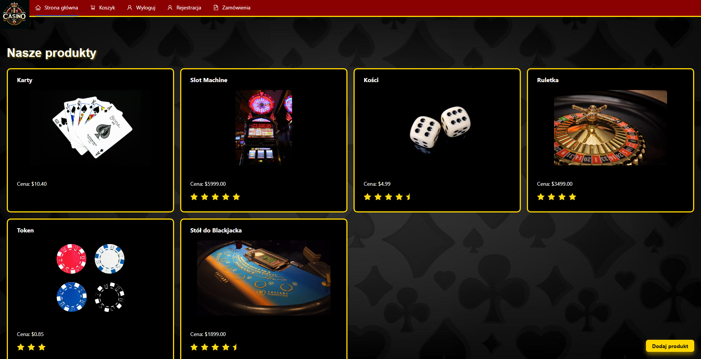
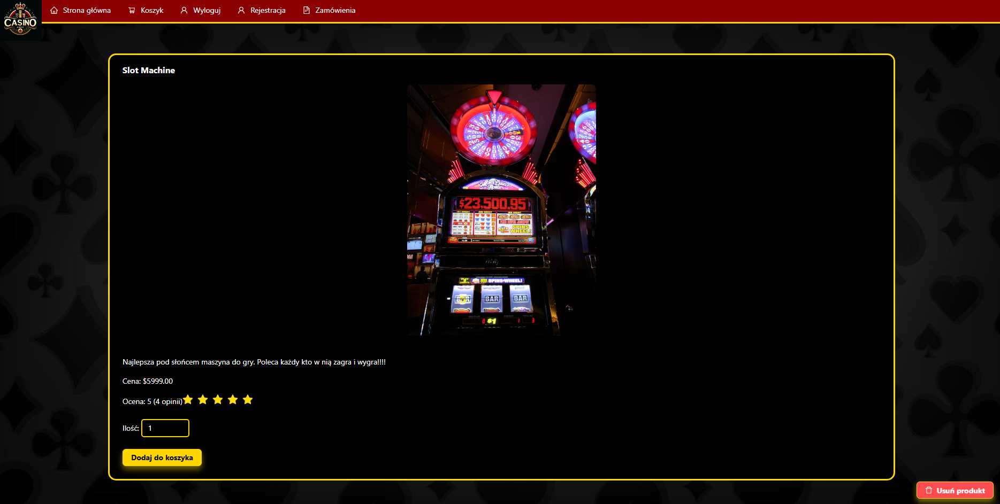
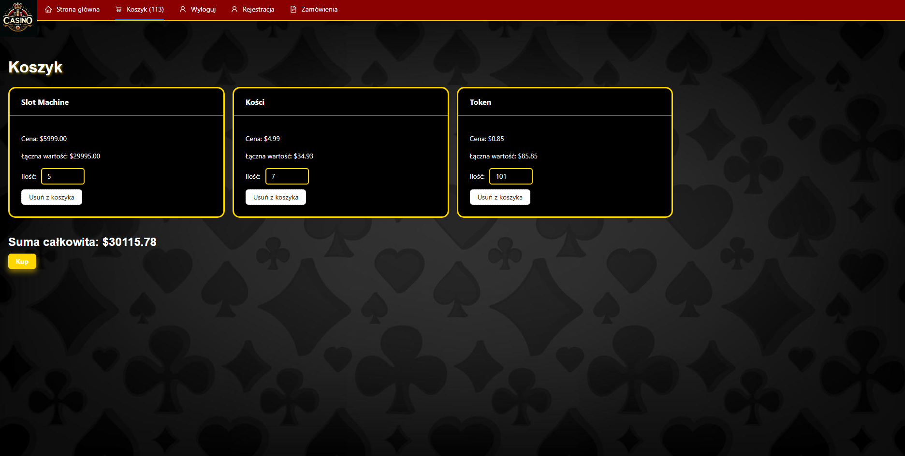

# 🎰 Casino Store - Fullstack Web Application

Casino Store to pełnoprawna aplikacja internetowa, umożliwiająca użytkownikom przeglądanie i zakup produktów związanych z kasynem. Projekt został stworzony z wykorzystaniem technologii **React** (frontend), **Node.js** (backend) oraz **MongoDB** (baza danych). Oprócz podstawowych funkcji sklepu internetowego oferuje także dynamiczną obsługę użytkowników oraz interaktywne elementy wizualne.

## 📌 Funkcjonalności

✅ Przeglądanie szerokiej gamy produktów kasynowych, takich jak żetony, karty, stoły, ruletki, automaty do gry i wiele innych.\
✅ Wyświetlanie szczegółowych informacji o produktach, w tym cen oraz ocen.\
✅ Obsługa koszyka zakupowego z możliwością dodawania, usuwania i modyfikacji ilości produktów.\
✅ System rejestracji i logowania użytkowników.\
✅ Możliwość dodawania nowych produktów przez administratorów, co pozwala na rozbudowę katalogu.\
✅ Historia zamówień użytkownika oraz podgląd aktualnych zamówień.\
✅ Dynamiczna nawigacja i przejrzysty interfejs użytkownika.

## 🛠️ Technologie

### Frontend:

- React + TypeScript
- Vite
- Ant Design (biblioteka komponentów UI)
- Axios (do komunikacji z backendem)
- React Router (zarządzanie trasami)

### Backend:

- Node.js
- Express.js
- MongoDB + Mongoose
- CORS (obsługa polityki Cross-Origin Resource Sharing)

## 📦 Wymagane biblioteki

Aby uruchomić projekt, należy zainstalować następujące zależności:

### Backend:

```sh
npm install express mongoose cors body-parser
```

### Frontend:

```sh
npm install react-router-dom axios antd @vitejs/plugin-react
```

## 📂 Struktura projektu

```
Projekt/
│── Backend/
│   │── models/          # Modele bazy danych
│   │── routes/          # Endpointy API
│   │── app.js           # Główny plik backendu
│   │── package.json     # Zależności backendu
│
│── Frontend/
│   │── src/
│   │   │── api/        # Żądania do backendu
│   │   │── components/ # Komponenty UI
│   │   │── pages/      # Widoki aplikacji
│   │   │── hooks/      # Własne hooki Reacta
│   │   │── context/    # Zarządzanie stanem koszyka
│   │   │── App.tsx     # Główny komponent aplikacji
│   │   │── styles.css  # Główny plik css
│   │── package.json    # Zależności frontendowe
│
│── .gitignore
│── README.md
```

## 🚀 Uruchamianie projektu

1. **Klonowanie repozytorium:**

   ```sh
   git clone https://github.com/pswierzy/ProjektFullStackShop
   cd ProjektFullStackShop/Projekt
   ```

2. **Instalacja zależności:**

   ```sh
   cd Backend
   npm install
   cd ../Frontend
   npm install
   ```

3. **Uruchomienie backendu:**

   ```sh
   cd Backend
   node app.js
   ```

4. **Uruchomienie frontendu:**

   ```sh
   cd Frontend
   npm run dev
   ```

Aplikacja będzie dostępna pod adresem `http://localhost:5173/`.

## 🗄️ Konfiguracja bazy danych

Baza danych znajduje się na **MongoDB Atlas**. Aby poprawnie skonfigurować backend, należy w pliku `app.js` w katalogu `Backend` i dodać:

```javascipt
const uri = "TWÓJ_LINK_DO_BAZY_DANYCH";
```

## 📷 Podgląd

\
\


## 👥 Autorzy

- [Piotr Świerzy](https://github.com/pswierzy)
